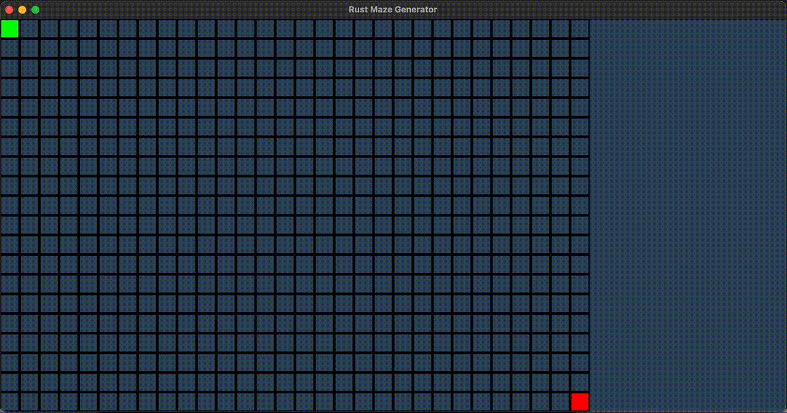

# Maze Generation and Solving

Simple Backtracking Maze Generator + A-Star solver using Rust.
Simple visualisation window created using Piston.

## Example

## Usage

Press P to pause the maze generation.

Press S to solve the current maze.

Press R to restart from scratch.

## TODO

A lot, includes :
    - Update Piston dependencies
    - General cleanup of the code
    - Implement other solvers/generators
    - CLI argument parsing and forwarding (simulation steps, start and end, ...)
    - Create a visualisation of the A-Star solver
    - ...
